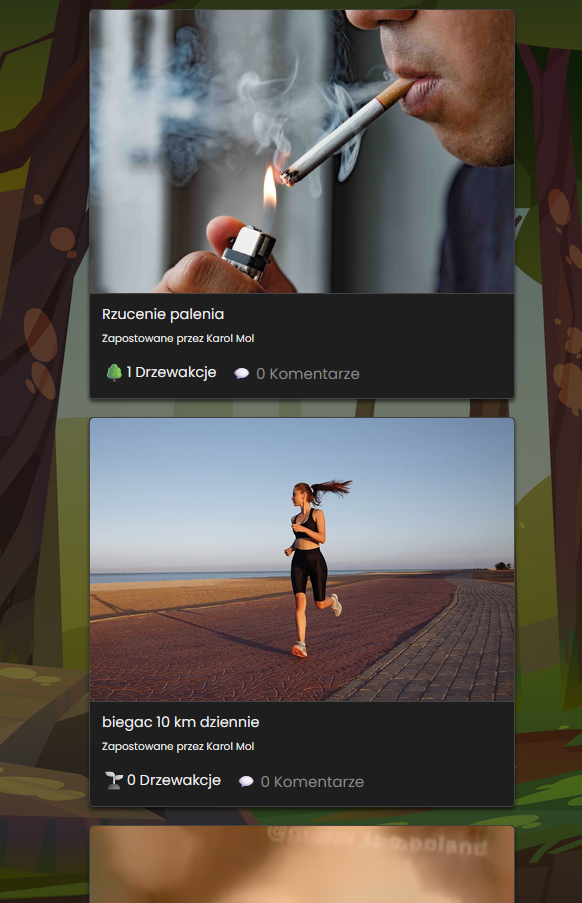
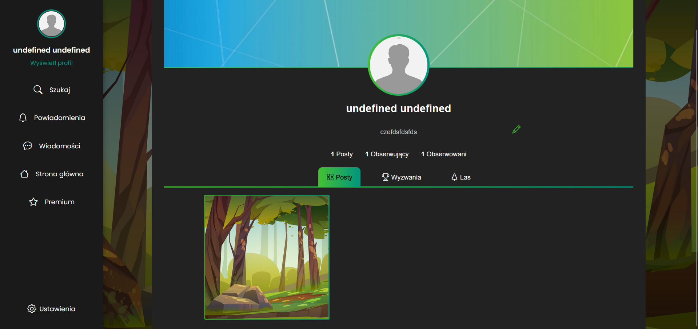
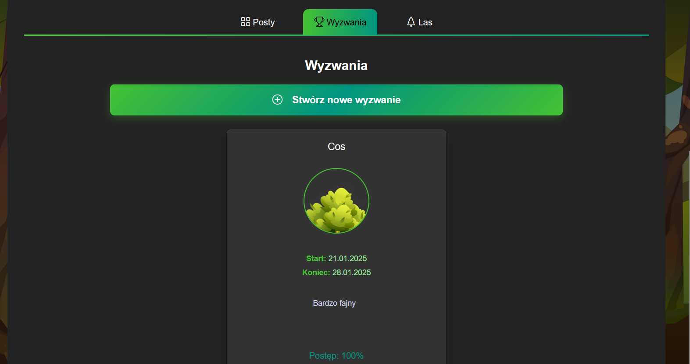
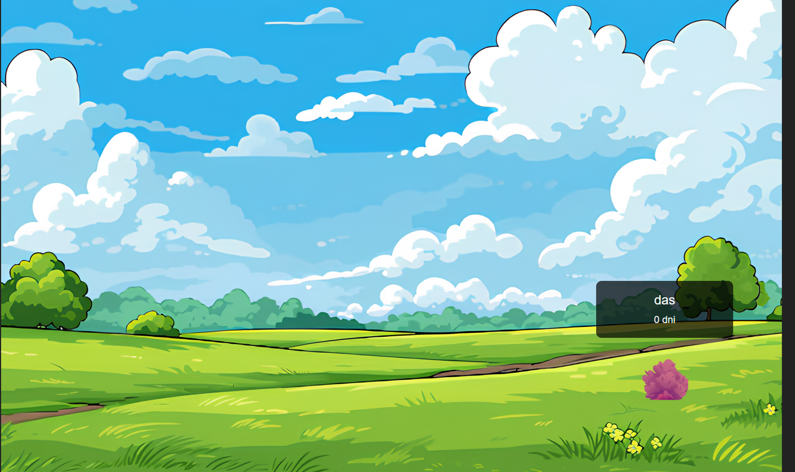
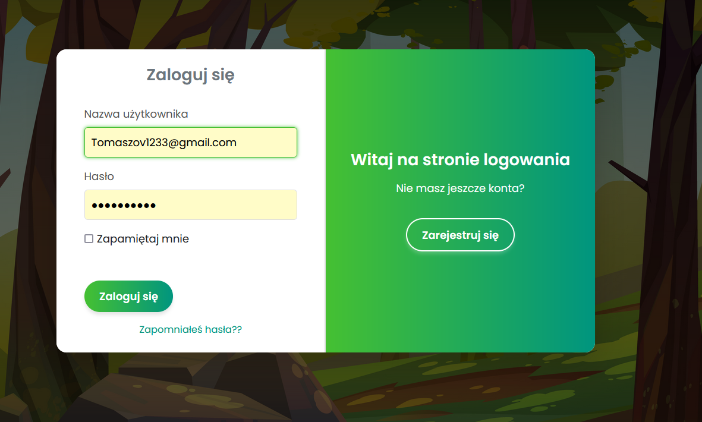
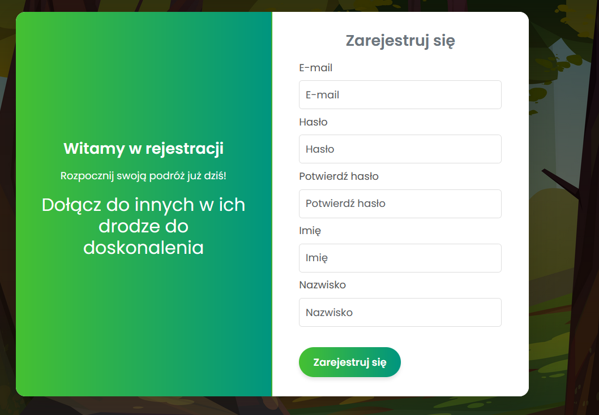
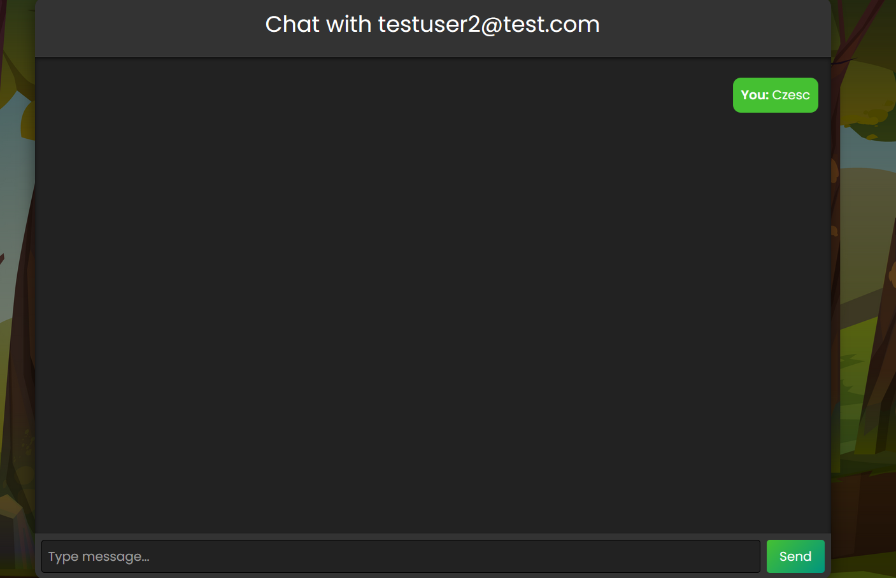
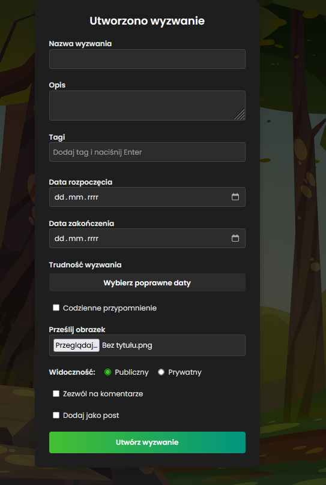
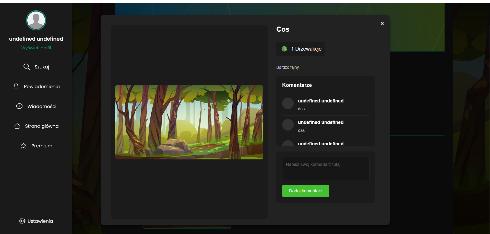
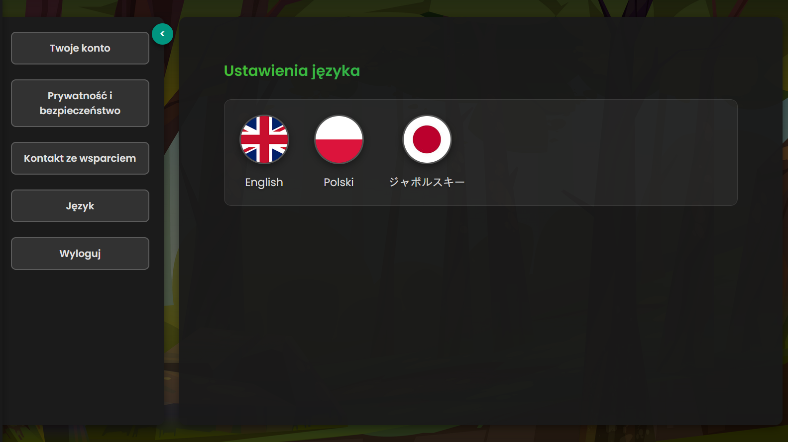

# Nazwa zespołu - TheForest; aplikacja który pomaga utrzymać postanowienia
Kacper Renkel (Szef), Nikodem Gronowski, Tomasz Milanowski, Maciej Dylak

## Table Of Content

- [Description](#description)

## Description

The motivation was to learn something new in React and NestJS and create a functional website that allows you to track your own progress in resolutions and sharing your progress with other users

   
Main Page

   
Profile Page

   
Challenge Tab

   
Done Challenges Tab

   
Login

   
Registration

   
Chat

   
Post Form

   
Post

   
Settings

